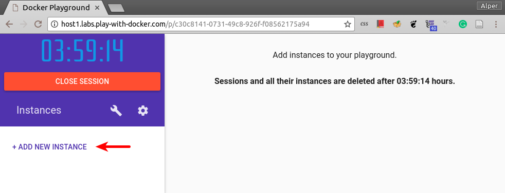
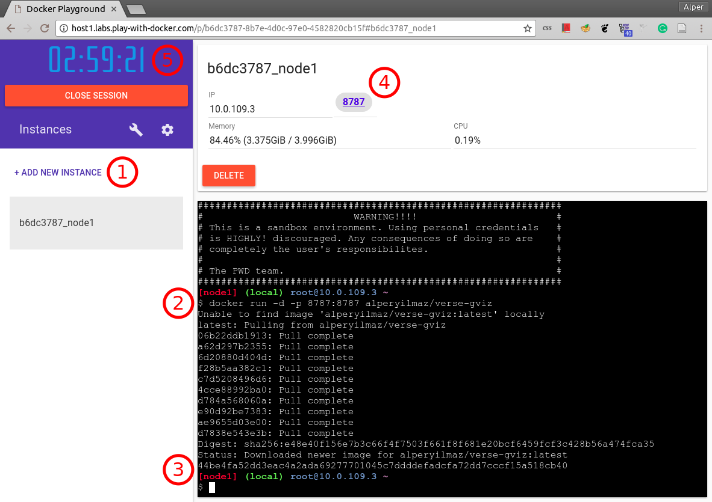

[](https://hub.docker.com/r/alperyilmaz/verse-gviz/) [](https://hub.docker.com/r/alperyilmaz/verse-gviz/) [](https://hub.docker.com/r/alperyilmaz/verse-gviz/) [](https://microbadger.com/images/alperyilmaz/verse-gviz "Get your own image badge on microbadger.com") [](https://microbadger.com/images/alperyilmaz/verse-gviz "Get your own license badge on microbadger.com")

# verse-gviz
rocker-verse container with Bioconductor Gviz

This (bloated) container is built on top of [rocker/verse](https://hub.docker.com/r/rocker/verse/) container so that genomic coordinate plots can be drawn with [Gviz](http://bioconductor.org/packages/release/bioc/html/Gviz.html) in Rstudio environment with reproducible manner. I needed such a container for teaching Data Analysis and Visualization course and Rmarkdown based publishing.

rocker/verse container includes:

* version stable base R (smaller container size compared to [r-base](https://hub.docker.com/r/_/r-base/)) and I used R version 3.4.1 
* Rstudio server
* tidyverse & devtools
* tex & publishing-related packages

## How to use

Run the following command in terminal

```
docker run -d -p 8787:8787 alperyilmaz/verse-gviz
```

In the first run `verse-gviz` container will be downloaded and it might take time based on your internet connection. Following runs will be instant.

After running this command, go to your browser and visit `http://localhost:8787` and you'll be greeted with Rstudio server login page. Both username and passwords are same which is `rstudio`. If needed be, rstudio server can be initiated with desired username and passwords with following command:

```
docker run -d -p 8787:8787 -e USER="studentno" -e PASSWORD="studentpass" alperyilmaz/verse-gviz
```

## Play with Docker usage

> UPDATE: In order to use *Play with Docker*, you need to login with a *DockerID*. Please sign up for one at Docker.com

If you're low on disk space, using Windows or having slow internet connection, then you can try or use this container online. The authors of [Play With Docker](http://play-with-docker.com/) site, Marcos Lilljedahl and Jonathan Leibiusky, made it possible to run containers online with breeze (if interested in technical details please watch their [demo](https://www.youtube.com/watch?v=-h2VTE9WnZs#t=3m03s) at DockerCon 2017). 

In order to use this container with Play with Docker:

* Please visit  [Play With Docker](http://labs.play-with-docker.com/) site
* (1) Click on `Add New Instance` (occasionally this might freeze, if that happens please re-visit the site)
  
* (2) On the terminal window, type `docker run -d -p 8787:8787 alperyilmaz/verse-gviz` and hit enter
* (3,4) After the process finished successfully, you'll see a link `8787` on top of the page
* When you click the link, you'll be at Rstudio server login page (username and passwords are `rstudio`)
* (5) **IMPORTANT** While using play with docker the instances have certain time limit (4 hours at the time of writing this note). When an instance is killed all data will be lost. So please copy over unsaved data to your local folder or git push frequently to prevent loss of data.



Happy reproducible researching ;)
